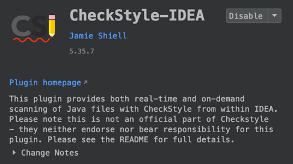
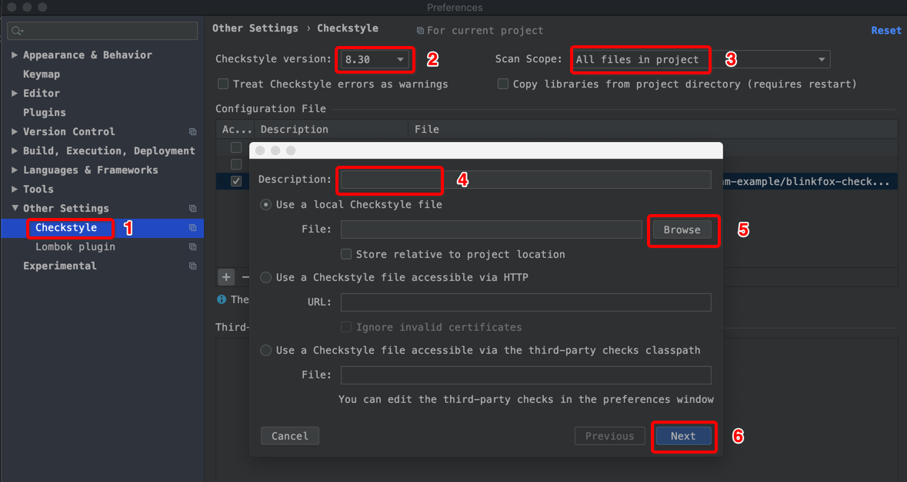
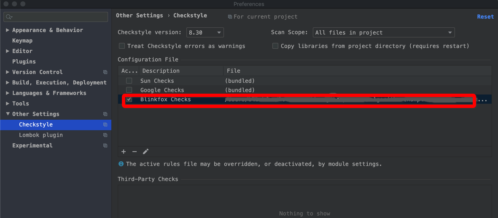

# Java 编程风格指南 (java-style)

这是关于 Java 编程风格相关的仓库。核心来自于 Google 的 Java 编程风格指南（(Google Java Style Guide)[https://checkstyle.sourceforge.io/styleguides/google-java-style-20180523/javaguide.html#s3.3.3-import-ordering-and-spacing]，并对该份英文指南做了翻译，并最终整理出了适合我和更多人的一份规范来。

## 主要内容

本仓库主要结构和内容如下：

```bash
- assets
  - ...                          # 一些图片类资源文件，不用理会.
- checks
  - blinkfox-checks.xml          # 经过部分新增、修改和详细注释的，符合 Blinkfox 编程风格的 checkstyle 文件.
  - blinkfox-idea-java-style.xml # 符合 Blinkfox 编程风格的，可导入 Intellij IDEA 中的 Java code style 的格式化文件.
  - google-checks.xml            # 未经修改的符合 Google 编程风格的原生 checkstyle 文件.
- google
  - Google Java Style Guide.md   # Google 原生的编程风格指南英文文档
  - Google Java 编程风格指南.md    # 翻译的 Google 原生的编程风格指南的中文文档
- Blinkfox Java 编程风格指南.md    # 基于 Google 原生的编程风格而新增、修改的，且符合 Blinkfox 编程风格的简要中文指南
- LICENSE                        # 仓库协议，Apache License2.0
- README.md                      # 仓库介绍文档.
```

## 如何使用

本仓库的核心产出结果主要是《Google Java 编程风格指南.md》、《Blinkfox Java 编程风格指南》、《blinkfox-checks.xml》、《blinkfox-idea-java-style.xml》。其中《Google Java 编程风格指南.md》和《Blinkfox Java 编程风格指南》是文档型，主要供大家阅读参考。而[《blinkfox-checks.xml》](https://github.com/blinkfox/java-style/blob/master/checks/blinkfox-checks.xml)和[《blinkfox-idea-java-style.xml》](https://github.com/blinkfox/java-style/blob/master/checks/blinkfox-idea-java-style.xml) 才是真正可实际用于工具和项目中的代码风格检查和格式化文件。

### 1. Maven 项目中集成使用 blinkfox-checks.xml

以下以 Maven 项目为例，介绍如何在 Java Maven 项目中集成使用 `blinkfox-checks.xml` 的 checkstyle 文件，你也可以查看此文件的内容，其中有详细的中文注释，你也可以对部分内容进行新增或修改，直到符合你自己或团队的代码风格要求。

#### 1.1 下载复制 blinkfox-checks.xml

首先，下载复制 [blinkfox-checks.xml](#) 文件到你的项目中，建议你将该文件放在与 `pom.xml` 文件**同级**的目录的中，当然你也可以放其他目录中，只不过需要额外在 Maven checkstyle 插件中配置目录位置。

#### 1.2 集成 maven-checkstyle-plugin 插件

然后，在你项目的 `pom.xml` 文件的 `build` -> `plugins` 层级下，添加 `maven-checkstyle-plugin` 插件，复制如下即可：

```xml
<plugin>
    <groupId>org.apache.maven.plugins</groupId>
    <artifactId>maven-checkstyle-plugin</artifactId>
    <!-- 目前最新版本是 3.1.1，你也可以选用之前的版本或以后更新的版本. -->
    <version>3.1.1</version>
    <dependencies>
        <dependency>
            <groupId>com.puppycrawl.tools</groupId>
            <artifactId>checkstyle</artifactId>
            <!-- 由于 blinkfox-checks.xml 的版本是 8.30 的，我们指定使用该版本的 checkstyle 进行检查. -->
            <version>8.30</version>
        </dependency>
    </dependencies>
    <configuration>
        <!-- 配置 blinkfox-checks.xml 文件的位置，这里即表示与 pom.xml 平级的目录. -->
        <configLocation>blinkfox-checks.xml</configLocation>
        <encoding>UTF-8</encoding>
        <consoleOutput>true</consoleOutput>
        <!-- 检查出错误时是否失败，这里设置为 true，利于做持续集成以及团队的代码风格强制性统一. -->
        <failsOnError>true</failsOnError>
        <linkXRef>false</linkXRef>
    </configuration>
    <executions>
        <execution>
            <id>validate</id>
            <!-- 在 validate 阶段就运行此插件，且运行的目标是只检查错误 (check)，你可以视情况修改成自己的值. -->
            <phase>validate</phase>
            <goals>
                <goal>check</goal>
            </goals>
        </execution>
    </executions>
</plugin>
```

#### 1.3 检查代码

然后在命令行中执行 `mvn clean validate` 即可，就能在控制台输出所有不符合规则的错误代码所在的文件和行、列、规则了。由于 checkstyle 检查的是源码，且 `validate` 在 Maven 命令的生命周期中是很早的一个阶段，你执行 `compile`、`test`、`install`、`deploy` 等等也都会执行该 `validate` 阶段，也就是说也都会检查代码是否符合规则。

同时在做持续集成时，能便于团队成员及早的规避代码风格不统一的问题。

### 2 Intellij IDEA 中使用 blinkfox-checks.xml

#### 2.1 下载 CheckStyle-IDEA 插件

首先确保在你的 Intellij IDEA 中已经安装了 `CheckStyle-IDEA` 插件。如果没有安装你可以在 IDEA 中直接在线安装，如果网络不理想的话，可以[前往这里下载](https://plugins.jetbrains.com/plugin/1065-checkstyle-idea)来离线安装此插件亦可。当然，安装完毕之后需要重启 IDEA。



#### 2.2 配置 blinkfox-checks.xml

然后，在**设置**里面 `Preferences`（或 `Settings`） -> `Other Settings` 中，找到并点击 `Checkstyle` 选项，通过 `+` 号按钮添加我们自己的 Checkstyle 配置文件，添写描述信息、添加你本地或远程地址上的 Checkstyle 文件，点击“下一步”，“完成”即可。





#### 2.3 在 IDEA 中进行检查

### 3. Intellij IDEA 中使用 blinkfox-idea-java-style.xml

待续 ...