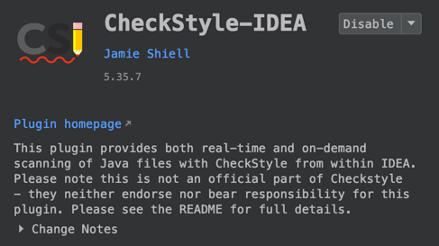
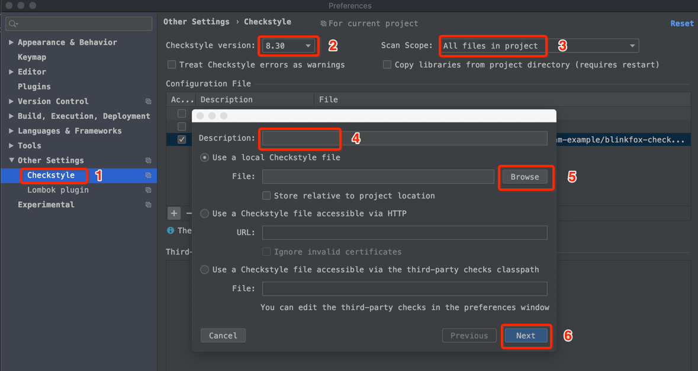
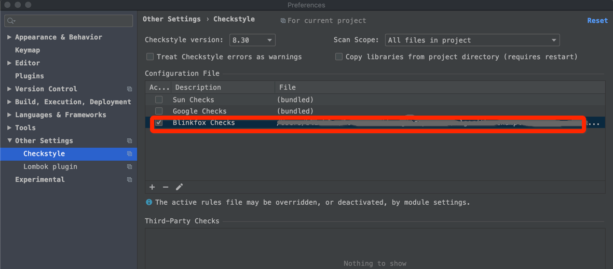
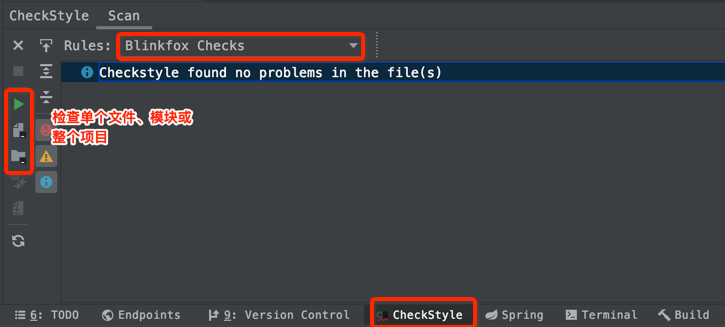
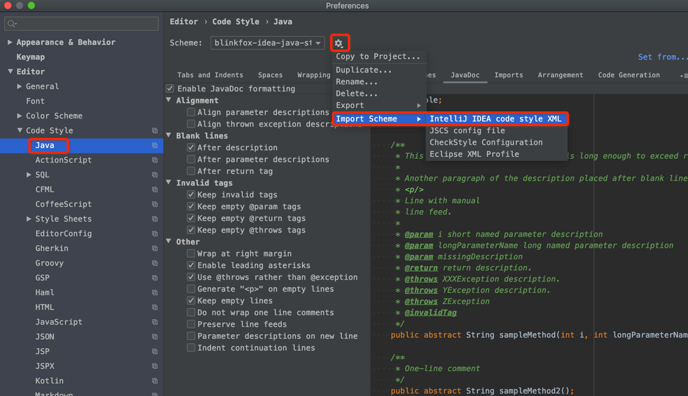

# 💡快速使用

[Blinkfox Java 编程风格指南](guide/blinkfox-java-style-guide.md)是 Blinkfox 根据 [Google Java 编程风格](https://checkstyle.sourceforge.io/styleguides/google-java-style-20180523/javaguide.html#s3.3.3-import-ordering-and-spacing)规范并根据自身使用情况而修改出的一份 Java 编程风格指南。相对于 Google 的 Java 编程风格文档而言，修改了部分规范，增加了一些更加确定性的规则说明，这样能最大程度上的让团队的代码风格统一、易读。

本文档仓库中[《blinkfox-checks.xml》](styles/blinkfox-checks.md)和[《blinkfox-idea-java-style.xml》](styles/blinkfox-idea-java-style.md) 是真正可实际用于项目和工具中的代码风格检查和格式化文件。

下面将介绍如何在项目或 Intellij IDEA 中集成使用相关的配置检查文件格式化文件等。

## 1 Maven 中集成 blinkfox-checks.xml :id=maven-blinkfox-checks

以下以 Maven 项目为例，介绍如何在 Java Maven 项目中集成使用 `blinkfox-checks.xml` 的 checkstyle 文件，你也可以查看此文件的内容，其中有详细的中文注释，你也可以对部分内容进行新增或修改，直到符合你自己或团队的代码风格要求。

### 1.1 下载 blinkfox-checks.xml

首先，下载复制 [blinkfox-checks.xml](#) 文件到你的项目中，建议你将该文件放在与 `pom.xml` 文件**同级**的目录的中，当然你也可以放其他目录中，只不过需要额外在 Maven checkstyle 插件中配置目录位置。

### 1.2 集成 maven-checkstyle-plugin

然后，在你项目的 `pom.xml` 文件的 `build` -> `plugins` 层级下，添加 `maven-checkstyle-plugin` 插件，复制如下即可：

```xml
<plugin>
    <groupId>org.apache.maven.plugins</groupId>
    <artifactId>maven-checkstyle-plugin</artifactId>
    <!-- 目前最新版本是 3.1.2，你也可以选用之前的版本或以后更新的版本. -->
    <version>3.1.2</version>
    <dependencies>
        <dependency>
            <groupId>com.puppycrawl.tools</groupId>
            <artifactId>checkstyle</artifactId>
            <!-- 由于目前 blinkfox-checks.xml 的版本是 9.3 的，我们指定使用该版本的 checkstyle 进行检查. -->
            <version>9.3</version>
        </dependency>
    </dependencies>
    <configuration>
        <!-- 配置 blinkfox-checks.xml 文件的位置，这里即表示与 pom.xml 平级的目录. -->
        <configLocation>blinkfox-checks.xml</configLocation>
        <encoding>UTF-8</encoding>
        <consoleOutput>true</consoleOutput>
        <!-- 检查出错误时是否失败，这里设置为 true，利于做持续集成以及团队的代码风格强制性统一. -->
        <failsOnError>true</failsOnError>
        <linkXRef>false</linkXRef>
    </configuration>
    <executions>
        <execution>
            <id>validate</id>
            <!-- 在 validate 阶段就运行此插件，且运行的目标是只检查错误 (check)，你可以视情况修改成自己的值. -->
            <phase>validate</phase>
            <goals>
                <goal>check</goal>
            </goals>
        </execution>
    </executions>
</plugin>
```

### 1.3 开始检查代码

然后在项目的命令行中执行下面的命令即可，就能在控制台输出所有不符合规则的错误代码所在的文件和行、列、规则了。

```bash
mvn clean validate
```

> **注**：由于 checkstyle 检查的是源码，且 `validate` 在 Maven 命令的生命周期中是很早的一个阶段，你执行 `compile`、`test`、`install`、`deploy` 等等也都会执行该 `validate` 阶段，也就是说也都会检查代码是否符合规则。

基于 Maven 插件的方式便于做持续集成，能使团队成员及早的规避代码风格不统一的问题。

## 2 IDEA 中使用 blinkfox-checks.xml :id=idea-blinkfox-checks

### 2.1 下载 CheckStyle-IDEA 插件

首先确保在你的 Intellij IDEA 中已经安装了 `CheckStyle-IDEA` 插件。如果没有安装你可以在 IDEA 中直接在线安装，如果网络不理想的话，可以[前往这里下载](https://plugins.jetbrains.com/plugin/1065-checkstyle-idea)来离线安装此插件亦可。当然，安装完毕之后需要重启 IDEA。



### 2.2 配置 blinkfox-checks.xml

然后，在**设置** `Preferences`（或 `Settings`） -> `Other Settings` 中，找到并点击 `Checkstyle` 选项，通过 `+` 号按钮添加我们自己的 Checkstyle 配置文件，添写描述信息、添加你本地或远程地址上的 Checkstyle 文件，点击“下一步”，“完成”即可。





### 2.3 在 IDEA 中进行检查

最后，在 IDEA 中点开 `CheckStyle` 窗口，选中之前添加的 `Blinkfox Checks` 配置，之后就可以对某个具体类、模块或项目进行检查了。



## 3 IDEA 中使用 blinkfox-idea-java-style.xml :id=idea-java-style

### 3.1 导入配置文件到 IDEA 中

`blinkfox-idea-java-style.xml` 是一个用于导入到 Intellij IDEA 中的代码格式化配置文件。可以[前往这里下载](https://github.com/blinkfox/java-style/blob/master/checks/blinkfox-idea-java-style.xml)，存放到你自己的某个本地文件目录中。

首先，在 **设置** `Preferences`（或 `Settings`） -> `Editor` -> `Code Style` -> `Java` 选项中，点击 Schema 后的设置按钮，点击 `Import Schema` -> `Intellij IDEA code style XML` 文件，选择你刚刚下载的 `blinkfox-idea-java-style.xml` 文件即可。



### 3.2 格式化和包导入优化

导入完成之后，可以在单个文件、文件夹、模块、项目的 Java 文件中，使用 `Ctrl + Alt + L` 来格式化文件，使代码更加符合规范和统一的风格。当然你还可以使用 `Ctrl + Alt + O` 来优化包的导入顺序。

## 开源协议

本项目基于 Apache License 2.0 协议开源。
